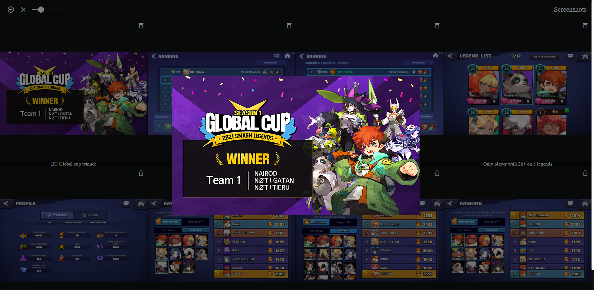

# <p align="center">📸 Screenshots 💻</p>

<p align="center">
    
</p>

## 📋 Table of contents
<details>
<summary>Click to reveal</summary>

- [About](#-about)
- [Requirements](#-requirements)
- [Building](#-building)
- [Usage](#-usage)
- [Author](#-author)

</details>

## 🔍 About

Screenshots is a personal project I developed to discover Angular, the last of the "big three" front-end frameworks (alongside Next.js and Vue.js) that I hadn’t yet explored.\
It is a screenshots manager that interfaces the equivalent of Windows's File Explorer's public/ into a more modern and visual listing in their respective games.\
While the core concept may seem straightforward, the path of a serverless indexedDB-based application proved to be challenging.\
This project ultimately got me hands-on experience with [Angular](https://angular.dev/), the [File System Web API](https://developer.mozilla.org/en-US/docs/Web/API/File_System_API), [IndexedDB](https://developer.mozilla.org/en-US/docs/Web/API/IndexedDB_API) and [Angular Material](https://material.angular.io/).

## 💻 Requirements

- [Node.js](https://nodejs.org/en)

## 🔧 Building

Run

```
npm install -g @angular/cli
npm i
ng serve
```
then head to http://localhost:4200

## 🎮 Usage

When arriving for the first time, you should be greeted by the only option of clicking anywhere on the page to select your public/ screenshots folder from the opened File Explorer (it remembers the path for the next times).\
This folder's architecture is easy:
- Games are folders (their name is the folder's name)
- Screenshots are images inside them (their name is the image file's name)
- The image inside a game folder with its name is its poster

Once selected, games' posters and names should appear in a grid, you can now;
- Add a new game by clicking on the top left "+" button and, in the opened dialog,
    - filling out its name
    - pasting or drag and droping its poster image
    - clicking the add button
- Delete the indexedDB, clearing both the selected public/ file's handle (used to create/delete games/screenshots) and the runtime-saved data (public/ images that weren't `ng serve`d can't be displayed unless I store their base64 data)
- Change the number of the games grid's columns between 2 and 10
- Delete a game by clicking its trash icon button
- Click on a game's poster to access its screenshots

On the clicked game's screenshots page, you'll find a grid with similar features except clicking on a screenshot enlarges it.\
Simply use the browser's arrows and scrollbar to navigate.

## 🤝 Author

[Nairod](https://github.com/NairodGH)